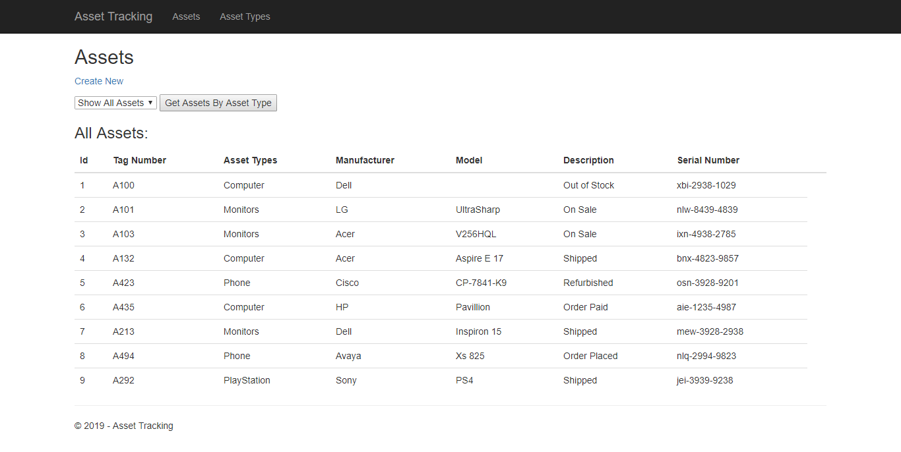
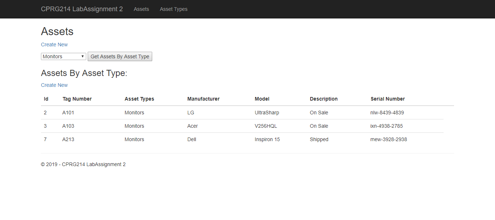
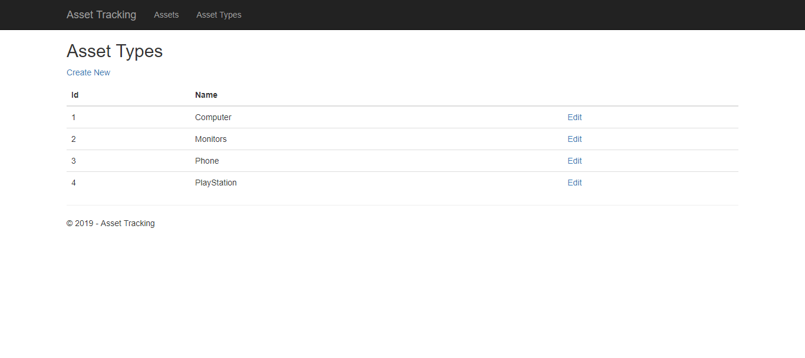

# Web-Based-Asset-Tracking-App
- ASP.NET Core MVC
- Microsoft Visual Studio
- Microsoft SQL Server

## Overview
A web application that is able to list all asset types in the system as well a page 
viewing all assets that can be filtered by asset type

### Assets
Assets are asynchronous filtered using Jquery AJAX method

### Asset Types

